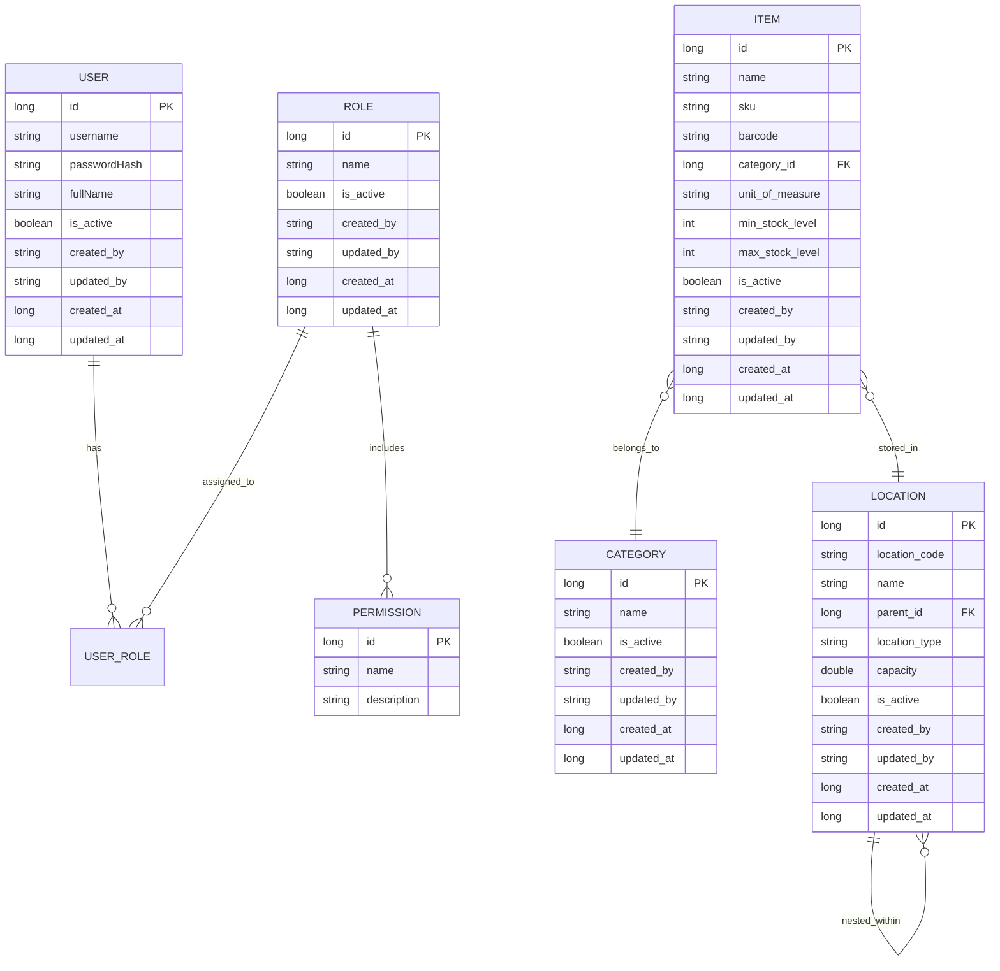

# AntHill Domain Model

The following diagram illustrates the domain model of the AntHill Inventory Management System, following the MVVM architecture and the audit/soft-delete patterns established in Phase 1.

